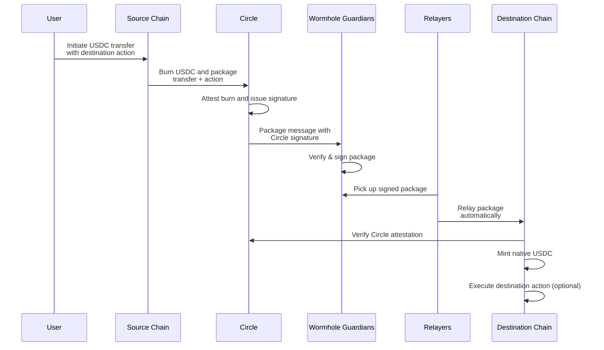

# CCTP with Wormhole Overview 

The integration of [Circle's Cross-Chain Transfer Protocol (CCTP)](https://www.circle.com/cross-chain-transfer-protocol){target=\_blank} with the Wormhole messaging protocol creates a robust system for securely and efficiently transferring native USDC across different blockchain networks while enabling more complex multichain interactions. This combination streamlines the movement of stablecoins, reduces risk, and unlocks new possibilities for decentralized applications.

## Key Features

- **Secure native USDC transfers** - at its core, CCTP provides a "burn-and-mint" mechanism for transferring native USDC. This eliminates the need for wrapped assets and the associated risks of intermediary bridges
- **Atomic execution** - by combining CCTP and Wormhole, the transfer of USDC and the execution of accompanying instructions on the destination chain can occur as a single atomic transaction
- **Automated relaying** - eliminates the need for users to redeem USDC transfers themselves
- **Enhanced composability** - developers can build more sophisticated cross-chain applications by sending additional data alongside the transfer
- **Gas drop off** - enables users to convert a portion of USDC into the destination chain's gas token upon a successful transfer
- **Gas payment** - covering destination gas in automated vs. manual transfers:
    - **Automated** - users often don't need destination gas tokens upfront, relayers cover these gas costs, reimbursed via gas drop-off or initial fees
    - **Manual** - users pay destination gas directly, the protocol may offer post-claim USDC-to-gas conversion

## How It Works

This section outlines the end-to-end flow for transferring native USDC across chains using CCTP while optionally triggering an action on the destination chain. Circle and Wormhole coordinate each step to ensure a secure, verifiable transfer and execution process.

1. **Initiation on source chain** - a user on the source chain initiates a USDC transfer and specifies the action to be executed on the destination chain
2. **Package burn and payload instructions** - Wormhole automates the transfer by packaging the USDC burn request and the destination chain action instructions into a single message
3. **Circle attestation** -  Circle's attestation service confirms the USDC burn on the source chain and issues a signature that is packaged together with the Wormhole message
4. **Guardians verify and sign** - Wormhole's [Guardians](/docs/protocol/infrastructure/guardians/){target=\_blank} observe and sign the package, achieving consensus on validity 
5. **Automated relay** - the [relayers](/docs/protocol/infrastructure/relayer/){target=\_blank} then automatically deliver the package to the destination chain
6. **Mint and verify** - Circle's attestation in Wormhole message triggers the minting of native USDC on the destination chain after verification
7. **Execute action** - any action on the destination chain executes if included in the message, potentially using the new USDC

!!! note 
    For a cross-chain transfer to be successful, both the source and destination chains must be among those supported by [Circle's CCTP](https://developers.circle.com/stablecoins/supported-domains){target=\_blank}.

## Use Cases

Integrating Wormhole's messaging with CCTP enables the secure transfer of native USDC across blockchains, unlocking key cross-chain use cases, which include:

- **USDC Payments Across Chains**
    - [**CCTP**](/docs/products/cctp-bridge/get-started/) – transfer native USDC using Circle’s burn-and-mint protocol
    - [**Wormhole TypeScript SDK**](/docs/tools/typescript-sdk/sdk-reference/) – automate attestation delivery and gas handling
    - [**Connect**](/docs/products/connect/overview/) – embed multichain USDC transfers directly in your app

- **USDC-Powered Multichain Settlement**
    - [**Settlement**](/docs/products/settlement/overview/) – use the Liquidity Layer to settle intents with native USDC
    - [**Wormhole TypeScript SDK**](/docs/tools/typescript-sdk/sdk-reference/) – initiate transfers, discover routes, and execute swaps seamlessly

## Next Steps

Now that you're familiar with CCTP, here is a list of resources for more hands-on practice:

- [**Get started with CCTP Bridge**](/docs/products/cctp-bridge/get-started/) - perform a multichain USDC transfer from Avalanche to Sepolia using Wormhole's TypeScript SDK and Circle's CCTP
- [**Complete USDC Transfer Flow**](Todo) - execute a USDC cross-chain transfer using Wormhole SDK and Circle's CCTP, covering manual, automatic, and partial transfer recovery
- [**Checkout Circle's CCTP Docs**](https://developers.circle.com/stablecoins/cctp-getting-started){target=\_blank} - learn more about Circle's cross-chain transfer protocol in their documentation