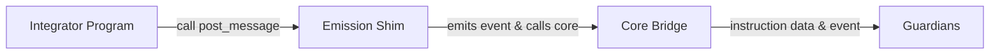

<!-- TODO add link in messaging overview -->

# Efficient Emission on Solana (Shim)

This guide explains how to use [Wormhole’s emission shim](/docs/products/messaging/concepts/solana-shim/){target=\_blank} on Solana to reduce the cost of message emission. The shim enables integrators to emit messages without creating a new account for each message, minimizing rent costs and state bloat while maintaining Guardian compatibility.

## Using the Emission Shim

The emission shim exposes a [`post_message`](https://github.com/wormhole-foundation/wormhole/blob/main/solana/bridge/program/src/api/post_message.rs){target=\_blank} instruction that matches the signature and accounts of `post_message_unreliable`. If you are already emitting messages via Wormhole, integrating the shim is a minimal change—primarily just switching the program address.

### Required Accounts

Your transaction to the shim’s post_message should include:

- `bridge`: Core Bridge config (mutable).
- `message`: PDA for posted message (signer, but not unique per message-the shim reuses it).
- `emitter`: The emitter address (Signer).
- `sequence`: PDA for sequence tracking (mutable).
- `payer`: Pays compute and (if needed) new account rent (Signer).
- `fee_collector`: Fee account (mutable).
- `clock`: Sysvar for current time.

These are exactly as expected for the regular core bridge interface.

### Data Payload

The instruction takes a `PostMessageData` struct, which consists of:

- `nonce` ++"u32"++: Unique value per message for replay protection.
- `payload` ++"Vec<u8>"++: The actual message data.
- `consistency_level` ++"enum"++: How many confirmations are required for the message to be considered valid.

Example Anchor call:

```rust
shim_program
    .post_message(
        ctx.accounts,
        nonce,
        payload,
        consistency_level,
    )?;
```

## How the Emission Shim Works

- **Shim Contract**: Exposes a `post_message` instruction with the same arguments as `post_message_unreliable`.
- **Sequence Handling**: Reads the sequence number from the core bridge and emits it in a [CPI event](https://www.anchor-lang.com/docs/basics/cpi){target=\_blank}, along with the timestamp.
- **Message Account**: Calls `post_message_unreliable` on the core bridge, writing an empty payload, so no unique message is stored on-chain.
- **Guardian Role**: Guardians reconstruct the message from instruction data and the emitted event, not from a persistent account.



The typical flow in your on-chain logic:

1. Prepare the accounts.
2. Call the shim’s `post_message`, passing your payload, nonce, and desired consistency level.

For most integrators, the only adjustment is to change the program ID to the shim and, if migrating mid-sequence, ensure you do not reuse any (emitter, sequence) pairs. Sequence tracking continues as before; only the storage model changes.

The emission fee is still paid. The sequence is tracked on the core bridge as usual. However, instead of storing your message in a new PDA account, the shim emits a CPI event with the sequence and timestamp, and passes an empty payload to the core bridge. All the data needed for Guardians is captured in the transaction logs.

## Migration Guidance

If migrating from the legacy emission path:

- Continue incrementing your emitter’s sequence number; do not reset or overlap with any previous values.
- No account resizing needed; the shim handles variable-length payloads by always passing an empty payload to the core bridge.
- For on-chain programs that only call the shim via CPI, consider emitting a dummy/empty message after migration to avoid edge cases with initial CPI depth (Solana limits the depth of cross-program calls).
- You still pay the Wormhole fee via `fee_collector` (parallelization limits apply).

## Guardian Behavior

Guardians are configured to:

- Watch for instructions to the emission shim’s program address.
- Extract the message data, emitter, sequence, and nonce from instruction data and the CPI event, not from an on-chain message PDA.
- Ignore the empty account that the core bridge might write (since the payload is empty), preventing duplicate VAAs.

At least 13/19 Guardians must monitor the shim for your emissions to reliably result in VAAs. Until then, shim emissions may not be processed by the full network.

## Limitations 

- **Rent**: No persistent account rent is paid for every emission—cost is now dominated by compute and the emission fee.
- **Logs**: Since all observability is log-based, re-observation is only possible while Solana transaction history is available.
- **Parallelization**: Still limited by the `fee_collector` account being mutable.
- **CPI Depth**: The first shim call for an emitter adds one extra stack depth. This is only relevant if you are near the Solana CPI limit (4).

## Deployment

- Build and deploy the emission shim to Solana using a verifiable build.
- Test the program on mainnet or testnet.
- Drop upgrade authority after confirming correct operation.
- See the [Solana Shim Deployment Guide](/docs/products/messaging/guides/solana-shims/shim-deployment/){target=\_blank} for detailed deployment steps.

## Security Considerations

Always ensure that every (emitter, sequence) pair is unique. Never emit two messages with the same combination, or you may create unredeemable VAAs. Once you’ve confirmed the shim works as intended, drop upgrade authority to prevent future tampering.

## Conclusion

By using the emission shim, you can dramatically reduce rent costs when emitting Wormhole messages from Solana, while ensuring compatibility with Guardian observation and core bridge sequencing.
