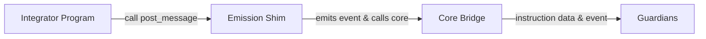

# Solana Message Emission via Shim

This guide explains how to use Wormhole’s emission shim on Solana to reduce the cost of message emission. The shim enables integrators to emit messages without creating a new account for each message, minimizing rent costs and state bloat while maintaining Guardian compatibility.

For more background, see [Solana Shims concept page](/docs/products/messaging/concepts/solana-shim/){target=\_blank}. 

## Using the Emission Shim

The emission shim exposes a [`post_message`](https://github.com/wormhole-foundation/wormhole/blob/main/solana/bridge/program/src/api/post_message.rs){target=\_blank} instruction that is closely modeled on the Core Bridge’s `post_message_unreliable`, but not identical. Integrators should follow the [IDL](https://github.com/wormhole-foundation/wormhole/blob/main/svm/wormhole-core-shims/anchor/idls/wormhole_post_message_shim.json){target=\_blank} when wiring accounts.

The main differences are:

- The shim uses a PDA per emitter for message accounts (so you don’t need to generate a new keypair each time).
- It emits the message data via an Anchor CPI event for Guardians to observe, instead of storing it in a persistent rent-exempt account.

### Required Accounts

When calling the shim’s `post_message` instruction, you should include the following:

- `bridge`: Core Bridge config.
- `message`: PDA derived from the emitter; reused by the shim instead of generating new accounts.
- `emitter`: The emitter address (signer).
- `sequence`: PDA for sequence tracking.
- `payer`: Pays compute and any rent needed on first use (signer).
- `fee_collector`: Fee account.
- `clock`: Sysvar for current time.
- `system_program`: Standard Solana system program (for account creation on first use).
- `wormhole_program`: The Wormhole Core Bridge program.
- `event_authority`: PDA used by the shim to emit log events (Anchor CPI events).
- `program`: The shim program itself.

### Data Payload

The instruction takes a `PostMessageData` struct, which consists of:

- `nonce` ++"u32"++: Unique value per message for replay protection.
- `payload` ++"Vec<u8>"++: The actual message data.
- `consistency_level` ++"enum"++: How many confirmations are required for the message to be considered valid.

Example Anchor call:

```rust
shim_program
    .post_message(
        ctx.accounts,
        nonce,
        payload,
        consistency_level,
    )?;
```

## How It Works

- **Shim Program**: Provides a `post_message` instruction modeled on the Core Bridge’s `post_message_unreliable`.
- **Sequence Handling**: The Core Bridge still manages sequence numbers. It reads the sequence number from the core bridge and emits it in a [CPI event](https://www.anchor-lang.com/docs/basics/cpi){target=\_blank}, along with the timestamp.
- **Message Account**: Calls `post_message_unreliable` on the core bridge, writing an empty payload, so no unique message is stored on-chain.
- **Guardian Role**: Guardians reconstruct the message from instruction data and the emitted event, not from a persistent account.


```mermaid
graph LR
    A[Integrator Program]
    B[Emission Shim]
    C[Core Bridge]
    D[Guardians]

    A -- call post_message --> B
    B -- emits event & calls core --> C
    C -- instruction data & event --> D
```

The typical flow in your on-chain logic:

1. Prepare the accounts.
2. Call the shim’s `post_message`, passing your payload, nonce, and desired consistency level.

The emission fee is still paid, and sequence numbers are still managed by the Core Bridge as before. The difference is that instead of creating a new message account for each emission, the shim emits a CPI event with the the message data. All the information Guardians need is captured in the transaction logs, without leaving behind permanent accounts.

## Migration Guidance

If migrating from the legacy emission path:

- No account resizing needed; the shim handles variable-length payloads by always passing an empty payload to the core bridge.
- For on-chain programs that only call the shim via CPI, consider emitting a dummy/empty message after migration to avoid edge cases with initial CPI depth (Solana limits the depth of cross-program calls).
- You still pay the Wormhole fee via `fee_collector` (parallelization limits apply).

## Guardian Behavior

Guardians are configured to:

- Watch for instructions to the emission shim’s program address.
- Extract the message data, emitter, sequence, and nonce from instruction data and the CPI event, not from an on-chain message.
- Ignore the empty account that the core bridge might write (since the payload is empty), preventing duplicate VAAs.

All 19 Guardians are configured to observe shim emissions on mainnet. As with all Wormhole messages, at least 13 of 19 Guardians must attest for a VAA to be produced and the shim emissions to be processed by the network.

## Limitations and Security Considerations 

- **Rent**: No persistent account rent is paid for every emission; the cost is now dominated by compute and the emission fee.
- **Logs**: Since all observability is log-based, re-observation is only possible while Solana transaction history is available.
- **Parallelization**: Still limited by the `fee_collector` account being mutable.
- **CPI Depth**: The first shim call for an emitter adds one extra stack depth. This is only relevant if you are near the Solana CPI limit (4).

## Conclusion

By using the emission shim, you can dramatically reduce rent costs when emitting Wormhole messages from Solana, while ensuring compatibility with Guardian observation and core bridge sequencing.


<!--
file should focus more on the concrete steps a new integrator would take to publish messages via the emission shim. example program instruction.
https://github.com/wormhole-foundation/wormhole/blob/main/svm/wormhole-core-shims/anchor/programs/wormhole-integrator-example/src/instructions/post_message.rs
-->