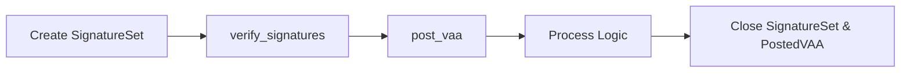

# Efficient VAA Verification on Solana (Shim)

This guide explains how to efficiently verify Wormhole VAAs on Solana by leveraging the core bridge’s [`verify_signatures`](https://github.com/wormhole-foundation/wormhole/blob/main/solana/bridge/program/src/api/verify_signature.rs){target=\_blank} and [`post_vaa`](https://github.com/wormhole-foundation/wormhole/blob/main/solana/bridge/program/src/api/post_vaa.rs){target=\_blank} instructions, and cleaning up temporary accounts after use.

The goal is to accumulate all guardian signatures into a temporary `SignatureSet` account using `verify_signatures`, verify the VAA and guardian set using `post_vaa`, and immediately close any accounts you created for this process.

Note that the shim is not a new contract or program. Instead, it’s a rent-efficient usage pattern of the existing Wormhole Core Bridge instructions (`verify_signatures` and `post_vaa`). By following this approach, you only create temporary accounts for the verification process and clean them up immediately afterward—leaving no permanent on-chain state.

For more background, see [Solana Shims concept page](/docs/products/messaging/concepts/solana-shim/){target=\_blank}. For deployment steps, see [Shim Deployment guide](/docs/products/messaging/guides/solana-shims/shim-deployment/){target=\_blank}.

## How It Works

The verification shim replaces the legacy multi-account pattern with a flow where you only create a temporary signature set account. After verification, you can close it to reclaim your lamports.

1. **Create a temporary SignatureSet account**: Fund it as rent-exempt for the required size.
2. **Call `verify_signatures`** as many times as needed, using the secp256k1 syscall and all guardian signatures. The SignatureSet account will accumulate valid signatures.
3. **Call `post_vaa`** to check guardian set validity, consensus, and VAA integrity.
   - If verification succeeds, proceed with your on-chain logic (e.g., updating state, processing transfers).
   - The `PostedVAA` account is created, but you do **not** need to keep it around for rent; it can be closed after use if you control it.
4. **Immediately close** the `SignatureSet` and any `PostedVAA` accounts you created to reclaim lamports, if you are the payer.



## Verify VAA

This instruction is intended to be invoked via CPI call. It verifies a digest against a GuardianSignatures account and a core bridge GuardianSet. Prior to this call, and likely in a separate transaction, `post_signatures` must be called to create the account. Immediately after this call, `close_signatures` should be called to reclaim the lamports.

A v1 VAA digest can be computed as follows:

```rust
let message_hash = &solana_program::keccak::hashv(&[&vaa_body]).to_bytes();
let digest = keccak::hash(message_hash.as_slice()).to_bytes();
```

A QueryResponse digest can be computed as follows:

```rust
use wormhole_query_sdk::MESSAGE_PREFIX;
let message_hash = [
  MESSAGE_PREFIX,
  &solana_program::keccak::hashv(&[&bytes]).to_bytes(),
].concat();
let digest = keccak::hash(message_hash.as_slice()).to_bytes();
```

## Caveats

This shim will need to include the following patch made to the core bridge when calculating the expiry for guardian sets.

```rust
pub fn is_active(&self, timestamp: &u32) -> bool {
    // Note: This is a fix for Wormhole on mainnet.  The initial guardian set was never expired
    // so we block it here.
    if self.index == 0 && self.creation_time == 1628099186 {
        false
    } else {
        self.expiration_time == 0 || self.expiration_time >= *timestamp
    }
}
```

Unlike the core bridge, it will not need to perform signature set deny-listing, as it does the verification directly through `secp256k1_recover`. 

Since it is planned to be non-upgradeable, any similar mitigation strategies will not be possible. e.g. the only way to expire a guardian set will be for the core bridge to properly expire it.

## Deployment

No special deployment is required—these are standard core bridge instructions. For advanced multi-program flows, see the [Solana Shim Deployment Guide](/docs/products/messaging/guides/solana-shims/shim-deployment/){target=\_blank} for detailed deployment steps.

## Limitations and Security Considerations

- You must be the payer and/or account owner to reclaim lamports from SignatureSet and PostedVAA accounts.
- The verification proof is ephemeral—no permanent on-chain record unless you keep the account.
- Compute usage (CU) is higher for the rent-efficient pattern, but total cost is dramatically lower than keeping permanent accounts.
- All validation guarantees remain as strong as with the legacy method.
- If you do not close accounts you create, rent will be lost as before.
- Only close accounts after all logic is complete; never close in the middle of validation.
- This approach assumes you do not need to later re-validate the VAA from an on-chain artifact.

## Conclusion

By following this flow, you can efficiently verify VAAs on Solana with minimal rent overhead, leaving no unnecessary state behind on-chain.

Ready to deploy? See the [Deployment guide](/docs/products/messaging/guides/solana-shims/shim-deployment/){target=\_blank} for full instructions.