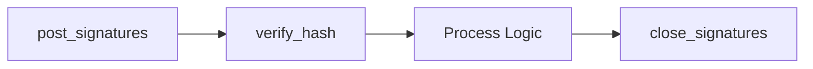

# Solana VAA Verification via Shim

Verifying VAAs on Solana with the legacy Core Bridge requires creating multiple rent-exempt accounts (for signatures and posted VAAs). These accounts persist even after verification is complete, which increases costs and bloats on-chain state.

The Verification Shim solves this by replacing the Core Bridge verification flow with its own instructions:

- `post_signatures`: Accumulates Guardian signatures into a temporary account.
- `verify_hash`: Validates the VAA by checking the signatures against the active Guardian set and ensuring quorum.
- `close_signatures`: Closes the temporary account to reclaim lamports.

Because the shim avoids leaving permanent accounts behind, verification becomes much cheaper while keeping the same security guarantees.

This page introduces the Verification Shim, explains how it works, and shows how integrators can adopt it in place of the Core Bridge’s `verify_signatures` and `post_vaa`.

For more background, see [Solana Shims concept page](/docs/products/messaging/concepts/solana-shim/){target=\_blank}. 

## How It Works

Instead of Core Bridge instructions like `verify_signatures` and `post_vaa`, the verification shim provides its own flow using `post_signatures`, `verify_hash`, and `close_signatures`. The flow is a simpler sequence that avoids leaving permanent accounts on-chain:

1. Call `post_signatures`: Creates (or appends to) a temporary `GuardianSignatures` account that stores the collected Guardian signatures. This account is owned and managed by the verification shim.
2. Call `verify_hash`: Verifies the digest of the VAA against the active Guardian set and checks quorum by recovering and validating each Guardian signature. If verification succeeds, your program can continue its logic.
3. Call `close_signatures`: Immediately close the `GuardianSignatures` account to reclaim the lamports paid for its creation.


```mermaid
graph LR
    A[post_signatures] --> B[verify_hash]
    B --> C[Process Logic]
    C --> D[close_signatures]
```

This flow ensures verification is both rent-efficient and secure, no permanent accounts remain, and Guardians still enforce quorum and integrity guarantees.

## Verify VAA

This instruction is intended to be invoked via CPI call. It verifies a digest against a GuardianSignatures account and a core bridge GuardianSet. Prior to this call, and likely in a separate transaction, `post_signatures` must be called to create the account. Immediately after this call, `close_signatures` should be called to reclaim the lamports.

A v1 VAA digest can be computed as follows:

```rust
let message_hash = &solana_program::keccak::hashv(&[&vaa_body]).to_bytes();
let digest = keccak::hash(message_hash.as_slice()).to_bytes();
```

A QueryResponse digest can be computed as follows:

```rust
use wormhole_query_sdk::MESSAGE_PREFIX;
let message_hash = [
  MESSAGE_PREFIX,
  &solana_program::keccak::hashv(&[&bytes]).to_bytes(),
].concat();
let digest = keccak::hash(message_hash.as_slice()).to_bytes();
```

## Limitations and Security Considerations

- You must be the payer and/or account owner to reclaim lamports from `GuardianSignatures` account.
- The verification proof is ephemeral—no permanent on-chain record unless you keep the account.
- Compute usage (CU) is higher for the rent-efficient pattern, but total cost is dramatically lower than keeping permanent accounts.
- All validation guarantees remain as strong as with the legacy method.
- If you do not close accounts you create, rent will be lost as before.
- This approach assumes you do not need to later re-validate the VAA from an on-chain artifact.

## Conclusion

By following this flow, you can efficiently verify VAAs on Solana with minimal rent overhead, leaving no unnecessary state behind on-chain.