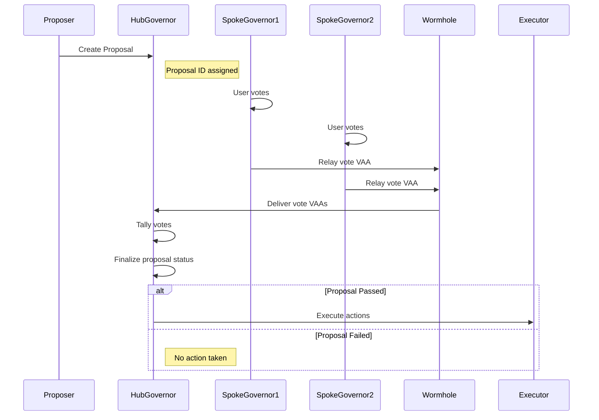

# Flow of a Proposal 

MultiGov enables decentralized governance across multiple blockchains by allowing a proposal to be created on a designated hub chain and voted on from various spoke chains. Votes are aggregated and the proposal is executed once consensus is reached.

This page outlines the full lifecycle of a proposal and the actors and modules involved at each step.

## Actors and Modules

- **Proposer**: User or contract creating the proposal.
- **HubGovernor**: Contract on the hub chain responsible for proposal storage, voting state, and execution.
- **SpokeGovernor**: Contract on spoke chains allowing users to vote and relaying those votes cross-chain.
- **Wormhole Messaging**: The underlying cross-chain transport layer for vote aggregation and execution messages.
- **Relayer**: Off-chain or on-chain service that submits Wormhole VAAs on destination chains.
- **Executor (optional)**: Target contract or system that the proposal affects when executed.

## Proposal Flow 

1. **Proposal Created on Hub**: 

    The **Proposer**, typically a DAO member or smart contract, creates a proposal by interacting with the **HubGovernor** contract on the hub chain. This proposal includes metadata, action payloads, and the voting timeline. Once submitted, it becomes immutable and is broadcast to all supported spoke chains.

2. **Voting Period Begins**: 

    When the proposal is activated, both the **HubGovernor** and each **SpokeGovernor** enter a voting state. On each chain, governance participants can review the proposal and prepare to cast votes using their local voting power.

3. **Users Vote on Spokes**: 

    Individual **Voters** interact with their local **SpokeGovernor** contract to cast a vote (for, against, or abstain). Votes are validated and recorded on the spoke chain. The **SpokeGovernor** queues them for relaying to the hub chain.

4. **Votes Relayed to Hub**: 

    The **SpokeGovernor** batches votes and emits Wormhole messages. These are transported via **Wormhole Messaging** and submitted to the **HubGovernor**. A relayer or automation service is responsible for delivering the signed VAAs. Once received, the **HubGovernor** verifies and tallies the votes.

5. **Voting Period Ends**: 

    After the vote deadline (defined at proposal creation), the **HubGovernor** contract stops accepting new votes. All final tallies are frozen and no additional state transitions can occur until result finalization.   

6. **Tally Finalized and Proposal Queued for Execution**: 

    The **HubGovernor** evaluates the total votes, checks quorum thresholds, and determines whether the proposal passed or failed. If successful, it marks the proposal as ready for execution. Failed proposals are simply archived.

7. **Proposal Executed**: 

    The **HubGovernor** executes the proposal. If the action payload is on the hub chain, it’s executed directly. If actions target spoke chains, messages are composed and sent via **Wormhole Messaging**, then delivered by a **Relayer** to the target **Executor** contract or system.

## Next Steps