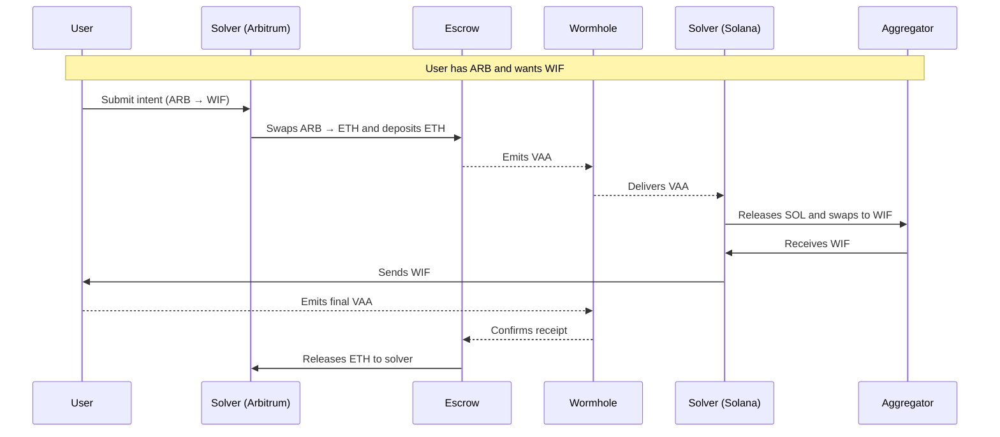

# Settlement Overview 

Wormhole Settlement is a multichain transfer system that allows users to describe the transfer they want to make without handling the execution themselves. Instead, off-chain agents called solvers compete to fulfill these user intents.

Settlement was built to address liquidity fragmentation across chains. Traditionally, solvers had to split their capital between multiple networks, which reduced efficiency and scalability. Settlement solves this by consolidating liquidity on Solana, enabling faster execution and minimal slippage, even as liquidity and supported chains scale.

It combines three complementary protocols into a single integration suite, allowing developers to select the best execution route based on cost, speed, and asset requirements.

## Key Features

- **Intent-based architecture**: Users express what they want to happen (e.g., swap X for Y on chain Z), and solvers execute it.
- **Solver auctions**: Solvers compete in on-chain auctions for the right to fulfill intents, improving execution quality.
- **Unified liquidity**: Liquidity is concentrated on Solana, reducing fragmentation and facilitating easier scaling.
- **Minimal slippage**: Settlement abstracts away complex balancing operations and uses shuttle assets like USDC and tokens deployed via NTT.
- **Three interchangeable routes**: Each with distinct tradeoffs in speed, cost, and protocol requirements.

## How It Works

At the core of Settlement are two components:

- **Intents**: Signed transactions where a user defines what outcome they want (e.g., send USDC to another chain and receive ETH). It abstracts what the user wants, not how it should be executed.
- **Solvers**: Third-party agents that compete in auctions to fulfill these intents. They front capital, perform swaps or transfers, and receive fees in return.

Settlement leverages the following three integrated protocols.

### Mayan Swift

Mayan Swift implements a traditional intent-based architecture, where solvers compete to fulfill user intents by utilizing their inventory. It offers fast execution, typically around 12 seconds. To participate, solvers must hold assets on multiple chains, which can lead to imbalances: some chains may get depleted while others accumulate excess. This requires occasional rebalancing and adds operational overhead. Despite that, Mayan Swift is ideal for high-speed transfers and benefits from open, competitive auctions that can drive down execution prices.

The diagram below shows how Mayan Swift handles a cross-chain intent when a user wants to swap ARB on Arbitrum for WIF on Solana. Behind the scenes, the process is more involved and relies on solver-managed liquidity across both chains.

1. **Solver initiates on Arbitrum**: Solver swaps ARB → ETH and deposits ETH into an escrow on Arbitrum.
2. **VAA emitted to Solana**: A [Verifiable Action Approval (VAA)](/docs/protocol/infrastructure/vaas/){target=\_blank} triggers the solver to release SOL on Solana, which is swapped to WIF using an aggregator.
3. **User receives WIF**: Once the user receives WIF, a second VAA finalizes the transfer and releases the ETH held in the escrow to the solver.
4. **Failure handling**: If any step fails, the ETH in escrow is either retained or returned to the user — the solver only gets paid if execution succeeds.

### Liquidity Layer

The Liquidity Layer utilizes a hub-and-spoke architecture, with Solana serving as the central hub for liquidity. Solvers only need to provide liquidity on Solana, eliminating the need for cross-chain inventory management. This route relies on USDC and NTT as shuttle assets and executes transactions in roughly 15 to 25 seconds. Solvers participate in on-chain English auctions to win execution rights and front the necessary assets to fulfill user intents. The design removes the need for rebalancing, making it more scalable and capital-efficient, especially for high-volume or frequently used applications.

### Mayan MCTP

Mayan MCTP is a fallback protocol that wraps Circle’s CCTP into the Settlement framework. It bundles USDC bridging and swaps into a single operation handled by protocol logic. This route is slower due to its reliance on chain finality. However, it provides broad compatibility and redundancy, making it useful when faster routes are unavailable or when targeting chains that aren’t supported by Swift or the Liquidity Layer. While typically more expensive due to protocol fees, it’s a reliable way to ensure settlement completion in edge cases.

### One Integration, Three Ways

Settlement isn't about choosing just one route; it’s a protocol suite in which all three architectures work together to maximize coverage, speed, and reliability.

By default, Settlement integrates all three:

- The SDK automatically resolves the best route for each transfer.
- If a fast route like Mayan Swift is unavailable, it can fall back to Liquidity Layer or MCTP.
- This redundancy ensures better uptime, pricing, and a smoother user experience without requiring additional logic.

Developers can customize route preferences, but for most applications, no configuration is needed to benefit from the full suite.

To read more about each protocol, check the [architecture documentation](/docs/products/settlement/concepts/architecture/){target=\_blank}.

## Use Cases

- **Cross-Chain Perpetuals** 

    - [**Settlement**](/docs/products/settlement/get-started/){target=\_blank} - fast token execution across chains
    - [**Queries**](/docs/products/queries/overview/){target=\_blank} – fetch live prices and manage position state across chains

- **Bridging Intent Library**

    - [**Settlement**](/docs/products/settlement/get-started/){target=\_blank} - handles user-defined bridge intents
    - [**Messaging**](/docs/products/messaging/overview/){target=\_blank} – triggers cross-chain function calls

- **Multichain Prediction Markets**

    - [**Settlement**](/docs/products/settlement/get-started/){target=\_blank} – executes token flows between chains
    - [**Queries**](/docs/products/queries/overview/){target=\_blank} – gets market data and tracks state

## Next Steps

Start building with Settlement or dive deeper into specific components:

- **[Get Started with Settlement](/docs/products/settlement/get-started/)**: Follow a hands-on demo using Mayan Swift.
- **[Build on the Liquidity Layer](/docs/products/settlement/guides/liquidity-layer/)**: Integrate the hub-and-spoke model.
- **[Run a Solver](/docs/products/settlement/guides/solver/)**: Operate a solver and participate in auctions.

