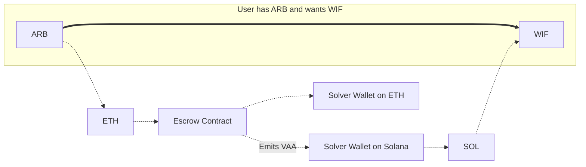
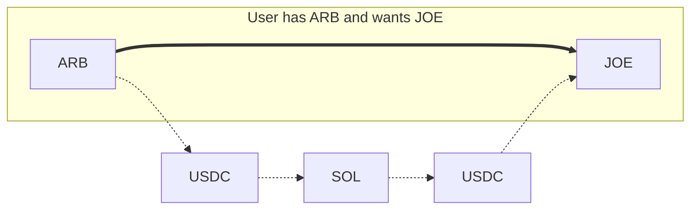

# Settlement Overview 

Wormhole Settlement is a multichain transfer system that lets users describe what they want, like sending or swapping tokens, without handling the execution themselves. Instead, off-chain agents called solvers compete to fulfill these user intents.

Settlement was built to address liquidity fragmentation across chains. Traditionally, solvers had to split their capital between multiple networks, which reduced efficiency and scalability. Settlement solves this by consolidating liquidity on Solana, enabling faster execution and minimal slippage, even as liquidity and supported chains scale.

It combines three complementary protocols into a single integration suite, letting developers pick the best execution route based on cost, speed, and asset requirements.

## Key Features

- **Intent-based architecture**: users express what they want to happen (e.g., swap X for Y on chain Z), and solvers execute it
- **Solver auctions**: solvers compete in on-chain auctions for the right to fulfill intents, improving execution quality
- **Unified liquidity**: liquidity is concentrated on Solana, reducing fragmentation and making scaling easier
- **Minimal slippage**: Settlement abstracts away complex balancing operations and uses shuttle assets like USDC and NTT
- **Three interchangeable routes**: each with distinct tradeoffs in speed, cost, and protocol requirements

## How It Works

At the core of Settlement are two components:

- **Intents**: these are signed transactions where a user defines what outcome they want (e.g., send USDC to another chain and receive ETH). It abstracts what the user wants, not how it should be executed
- **Solvers**: third-party agents that compete in auctions to fulfill these intents. They front capital, perform swaps or transfers, and receive fees in return

Settlement leverages three integrated protocols:

<!--
waiting with publishing until the Product team gives more information regarding the upcoming plans for Settlement

| Feature                | Mayan Swift               | Liquidity Layer          | Mayan MCTP                             |
|------------------------|---------------------------|--------------------------|----------------------------------------|
| Architecture           | Intent architecture       | Hub-and-spoke model      | CCTP wrapper                           |
| Speed                  | ~12 seconds               | ~15–25 seconds           | Slower, depends on chain finality      |
| Liquidity Location     | Distributed across chains | Consolidated on Solana   | Uses CCTP to move liquidity            |
| Liquidity Requirements | Inventory on all chains   | Liquidity on Solana only | None (relayer handles bridging + swap) |
| Rebalancing Required   | Yes                       | No                       | No                                     |
| Asset Support          | Primary assets            | USDC and NTT             | USDC only                              |

-->

### Mayan Swift

- Implements a typical intent architecture with fast execution (~12 seconds)
- Requires solvers to hold inventory across chains
- Prone to imbalances (some chains depleted, others overfilled), requires rebalancing assets
- Best for high-speed transfers with primary assets
- Features open auctions and competitive pricing

### Liquidity Layer

- Uses a hub-and-spoke model with Solana as the hub
- No rebalancing needed, liquidity sits only on Solana
- Solvers join on-chain English auctions and fulfill intents by fronting assets
- Relies on USDC and NTT as shuttle assets
- Execution takes ~15–25 seconds

### Mayan MCTP

- A fallback protocol using Circle’s CCTP
- Bundles USDC bridging and swaps in one operation
- Slower due to finality requirements, but highly reliable
- Provides execution redundancy and supports chains without fast auction infrastructure

### One Integration, Three Routes

Settlement isn't about choosing just one route; it’s a unified system in which all three protocols work together to maximize coverage, speed, and reliability.

By default, Settlement integrates all three:

- The SDK automatically resolves the best route for each transfer
- If a fast route like Mayan Swift is unavailable, it can fall back to Liquidity Layer or MCTP
- This redundancy ensures better uptime, pricing, and a smoother user experience without extra logic

Developers can customize route preferences, but for most applications, no configuration is needed to benefit from the full suite.

## Use Cases

## Next Steps