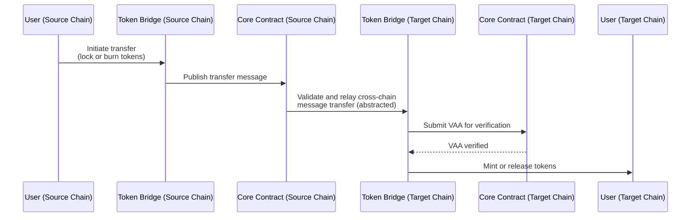

# Token Bridge Architecture

## Introduction

The [Wormhole Token Bridge](/products/token-bridge/overview/){target=\_blank} enables token transfers across blockchains by combining token-specific logic with [Wormhole's core messaging layer](/docs/protocol/architecture/){target=\_blank}. Each supported chain runs its own Token Bridge contract, which manages actions like locking, burning, minting, and releasing tokens. These contracts communicate directly with the [Core Contracts](/docs/protocol/infrastructure/core-contracts/){target=\_blank} to securely transmit messages between chains using Wormhole's decentralized messaging infrastructure.

This guide provides a conceptual overview of how the Token Bridge works, integrates with the messaging layer, and the responsibilities of each component in a cross-chain token transfer.

## Architecture Overview

Cross-chain token transfers using the Token Bridge follow these steps:

1. **User calls Token Bridge on source chain**: The user initiates the transfer by calling the Token Bridge contract on the source chain, which locks or burns tokens.
2. **Token Bridge publishes transfer message via Core Contract**: The Token Bridge contract interacts with the Core Contract on the source chain to publish the transfer message.
3. **Guardians validate transfer message**: The Core Contract emits an event that Guardians observe and validate. A supermajority—at least 13 out of 19—signs this message to produce a Verifiable Action Approval (VAA), cryptographically authorizing the cross-chain transfer.
4. **Relayers deliver signed message**: Off-chain relayers or client applications deliver the signed VAA to the Token Bridge contract on the target chain, allowing the transfer process to continue.
5. **Token Bridge verifies message and completes transfer**: The Token Bridge contract verifies the message (VAA) with the Core Contract, then mints or releases tokens to the user's destination address.
6. **User receives tokens on the target chain**: The user obtains the transferred tokens on the target chain, completing the cross-chain transfer.

The user interacts only with the Token Bridge contracts, which handle token-specific logic and message coordination throughout this process. The Core Contracts, Guardians, and relayers operate behind the scenes to provide decentralized, secure cross-chain communication.

This modularity allows the Token Bridge to remain lightweight and focused on token logic, while the Core layer handles all aspects of cross-chain messaging—Guardian signatures, VAA structure, and security.

## Token Bridge Responsibilities

To recap the architecture overview, the following breakdown details the responsibilities of the Token Bridge contracts on both the source and target chains.

### On the Source Chain

The Token Bridge contract on the source chain is responsible for:

- Accepting and validating user-initiated transfer requests.
- Locking (for wrapped assets) or burning (for canonical assets) the specified token amount.
- Encoding the transfer metadata.
- Passing the message to Wormhole's core message layer.

### On the Target Chain

The Token Bridge contract on the target chain is responsible for:

- Accepting submitted VAAs from users or relayers.
- Verifying VAAs with the Core Contract.
- Minting (for wrapped assets) or releasing (for canonical assets) the corresponding tokens to the recipient’s address.

