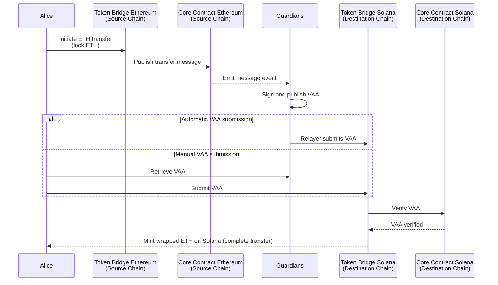
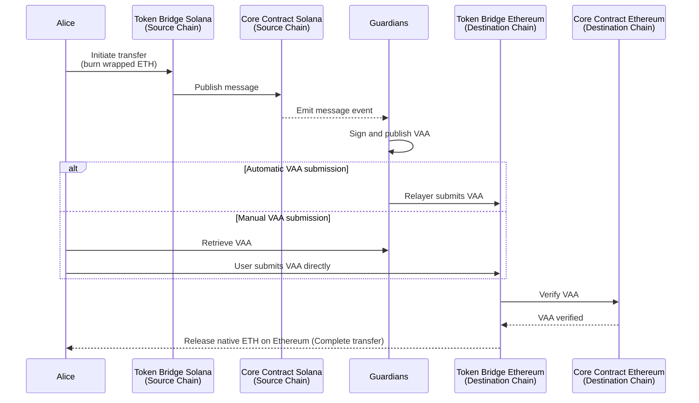
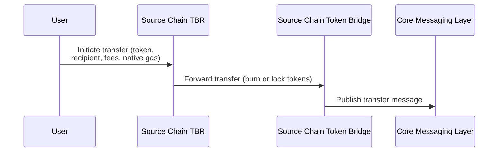
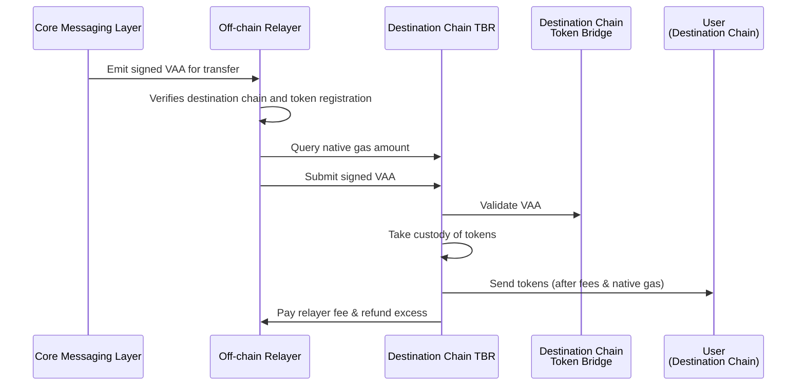

# Flow of a Transfer

## Introduction

The [Wormhole Token Bridge](/docs/products/token-bridge/overview/){target=\_blank} enables token transfers across blockchains by combining token-specific logic with [Wormhole's core messaging layer](/docs/protocol/architecture/){target=\_blank}. Each supported chain runs its own Token Bridge contract, which manages actions like locking, burning, minting, and releasing tokens. These contracts communicate directly with Wormhole's core message-passing layer to securely transmit messages between chains.

This guide provides a conceptual overview of the Token Bridge and its integration with the messaging layer. It outlines each step of the transfer flow and explains how different transfer types work in practice.

## Transfer Flow

Cross-chain token transfers using the Token Bridge follow these steps:

1. **Initiation on the Source Chain**  
    The transfer begins when a user calls the Token Bridge contract on the source chain:

    - **Wrapped tokens**: The token is burned.
    - **Original tokens**: If the token is native to the source chain, the token is locked in the contract.

2. **Transfer Message Publication**  
    The Token Bridge contract invokes the Wormhole [Core Contract](/docs/protocol/infrastructure/core-contracts/){target=\_blank}, which emits an on-chain message event describing the transfer.

3. **Message Observation and Signing**  
    [Guardians](/docs/protocol/infrastructure/guardians/){target=\_blank}—a decentralized network of validators—monitor the source chain for these message events. A supermajority (13 out of 19) signs the event to generate a [Verified Action Approval (VAA)](/docs/protocol/infrastructure/vaas/){target=\_blank}—a cryptographically signed attestation of the transfer.

    The VAA is then published to the Wormhole network.

4. **VAA Submission to the Destination Chain**  
    The VAA must be submitted to the Token Bridge contract on the destination chain to complete the transfer. The Token Bridge contract then verifies the VAA by calling the Core Contract behind the scenes. This step can be handled in two ways:

    - **Automatic**: A relayer service detects the VAA and submits it to the Token Bridge contract.
    - **Manual**: The user or dApp retrieves the VAA and submits it directly to the Token Bridge contract.

5. **Finalization of the Transfer on the Destination Chain**  
   After the VAA is verified on the destination chain, the Token Bridge contract completes the transfer:

    - **Wrapped tokens**: A wrapped representation of the original token is minted.
    - **Original tokens**: If the token is native to the destination chain, the token is released to the recipient.

Consider this example: Alice wants to send 5 ETH from Ethereum to Solana. The ETH is locked on Ethereum’s Token Bridge, and an equivalent amount of wrapped ETH is minted on Solana. The diagram below illustrates this transfer flow.

Maybe Alice wants to transfer her wrapped ETH on Solana back to native ETH on Ethereum. The wrapped ETH is burned on Solana’s Token Bridge, and the equivalent 5 ETH are released on Ethereum. The diagram below illustrates this transfer flow.

## Automatic vs. Manual Transfers

The Token Bridge supports two modes of transfer, depending on whether the VAA submission step is handled automatically or manually:

- **Automatic**: A relayer service listens for new VAAs and automatically submits them to the destination chain.
- **Manual**: The user (or dApp) must retrieve the VAA and manually submit it to the destination chain.

Here's a quick breakdown of the key differences:

| Feature                   | Automatic Transfer          | Manual Transfer                     |
|---------------------------|-----------------------------|-------------------------------------|
| Who submits the VAA?      | Relayer                     | User or dApp                        |
| User Experience           | Seamless, one-step          | Requires manual intervention        |
| Best for                  | End-users, simple UIs       | Custom dApps, advanced control      |
| Dependency                | Requires relayer support    | None                                |

### Completing Manual Transfers

The user who initiated the transfer should complete the transfer within 24 hours for manual transfers. Guardian Sets are guaranteed to be valid for at least that long. If a user waits longer, the Guardian Set may have changed between initiation and redemption, causing the VAA to be rejected.

If this occurs, follow the [Replace Outdated Signatures in VAAs](){target=\_blank} tutorial to update the VAA with signatures from the current Guardian Set.

## Token Bridge Relayer (TBR)

When completing an automatic transfer using the Token Bridge—either through [Connect](/docs/products/connect/overview/){target=\_blank} or programmatically via the [Wormhole TypeScript SDK](/docs/tools/typescript-sdk/get-started/){target=\_blank}—the Token Bridge Relayer (TBR) manages the interaction with the underlying Token Bridge contracts on [supported chains where the TBR is available](/docs/products/connect/reference/support-matrix/){target=\_blank}.

<!-- TODO: add link to supported chains for TBR, pull this data in from the SDK and add it to the Token Bridge reference section. Eventually remove link to connect matrix -->

### Flow of an Automatic Transfer via TBR

The flow of an automatic transfer using the TBR looks like this:

1. **Initiation on the Source Chain**  
    The transfer begins when a user initiates a transfer on the source chain, which results in the TBR contract being called.

2. **Prepare and Forward the Transfer**  
    The TBR verifies the token, encodes transfer details (relayer fee, native gas request, recipient), and forwards the transfer to the Token Bridge.

3. **Core Messaging Layer Processes the Transfer**  
    The Token Bridge emits a message to the Core Contract. Guardians observe the message and produce a signed VAA attesting to the transfer. 

4. **Off-Chain Relayer Observes the VAA**

    An off-chain relayer verifies the destination chain and token registration and then prepares to complete the transfer.

5. **Relayer Computes Native Drop-Off and Submits the VAA** 

    The relayer queries the destination TBR for the native gas amount, includes it in the transaction, and submits the signed VAA.

6. **TBR Validates and Completes the Transfer**
    
    The destination TBR validates the VAA by invoking the Token Bridge contract, confirms it's from a registered TBR, verifies the token and native gas request, and then takes custody of the tokens.

6. **Asset Distribution on the Destination Chain**

    The TBR sends the remaining tokens and native gas to the user, pays the off-chain relayer fee, and refunds any excess native tokens.

The following diagram illustrates the key steps on the source chain during a transfer:

Once the core messaging layer processes the transfer, the destination chain handles completion as shown below:

## Next Steps

Now that you’ve seen how a transfer works try both types yourself to experience the full process:

- [Get Started with Token Bridge](/docs/products/token-bridge/get-started/){target=\_blank}