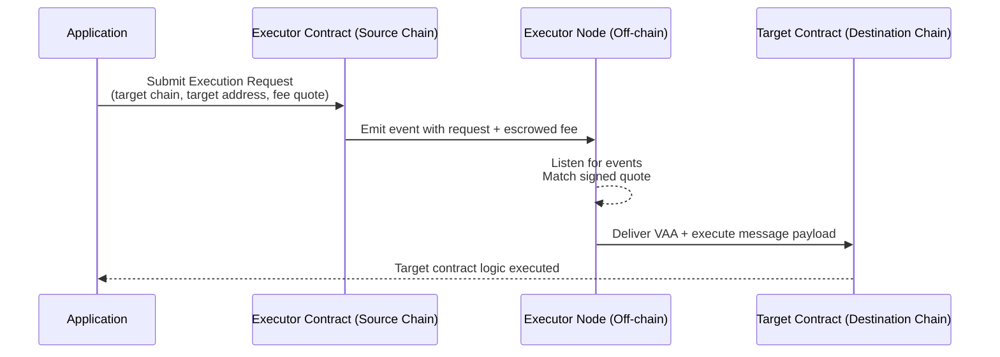

<!-- TODO
- links to repositories and addresses https://wormholelabs.notion.site/Executor-Addresses-Public-1f93029e88cb80df940eeb8867a01081 
-->

# Relayers

This page provides a comprehensive guide to relayers within the Wormhole network, describing their role, types, and benefits in facilitating multichain processes.

Relaying refers to the process of delivering a cross-chain message, specifically a [Verified Action Approval (VAA)](/docs/protocol/infrastructure/vaas/){target=\_blank}, from its source chain to the destination chain. In a multichain application, after a message is emitted on the source chain and signed by Wormhole’s Guardians, it needs to be carried over to the target chain’s contract – this is the relayer's job. 

Relayers do not need to be trusted, the security of Wormhole messages stems from the Guardian Network signatures on the VAA, which cannot be tampered with by relayers. In other words, a relayer cannot alter the content or outcome of a message – it can only affect when the message gets delivered (availability). This trust-minimized design means developers and users don’t have to trust a relayer service to preserve integrity, only to be online to forward the message.

## Fundamentals

This section highlights the crucial principles underpinning the operation and handling of relayers within the Wormhole network.

Relayers are fundamentally trustless entities within the network, meaning while they don't require your trust to operate, you also shouldn't trust them implicitly. They function as delivery mechanisms, transporting VAAs from their source to their destination.

- **Anyone can relay a message**: Guardians broadcast signed VAAs publicly, so any entity can retrieve a VAA and submit it to the destination chain’s contracts. The signatures provide universal verifiability, any Wormhole contract or client can check the Guardian signatures. These properties ensure that relaying can be permissionless and trustless. If one relayer is down, any other party (even the user) could take the VAA and deliver it. No relayer can forge or modify the message without invalidating the signatures.
- **Security is in the VAA**: The Wormhole Guardians’ signatures authenticate the message. A relayer might provide additional info or off-chain data, but contracts should not rely on anything that isn’t from a verified VAA or on-chain source. This ensures that even though relayers operate off-chain, they cannot compromise the application’s logic or funds. In summary, Wormhole relayers can’t compromise security, only availability – if a relayer misbehaves, the worst outcome is a delayed or missed delivery, not a falsified message.
- **User experience vs. infrastructure**: Relayers exist to improve user experience by automating cross-chain steps that would otherwise be manual. However, using relayers introduces considerations around fees and infrastructure. Developers must either rely on an external relayer service or run their own. Wormhole’s design offers flexibility: developers can choose an entirely client-side (no relayer) approach or opt for either Wormhole-provided relayer networks or custom relayers that developers build themselves. Each approach has its benefits and trade-offs in terms of complexity, cost, and control, as we explore next.

## Manual vs. Automated Relaying

When integrating Wormhole messaging, developers face a choice between manual (client-side) relaying and automated relaying. The distinction lies in the entity responsible for delivering the VAA to the target chain.

- **Manual Relaying (Client-Side)**: This approach puts the burden on the user or their client (e.g., a dApp or wallet) to carry out all cross-chain steps. After an action on chain A produces a VAA, the user must manually fetch that VAA (typically via a Wormhole API or explorer) and then submit it in a transaction on chain B. No specialized backend is needed. The relayer role is handled directly by the user via their wallet or web browser. The advantage is simplicity in architecture (no extra services to run) and no additional fees beyond the target chain’s transaction fees. However, this approach provides a limited user experience beyond basic demos, as it requires users to sign multiple transactions and maintain funds on each chain involved. This process can be cumbersome and error-prone, as the additional step may be unclear and lead to drop-offs. In summary, manual relaying is suitable for testing and MVPs, but it's not ideal for production-grade applications.
- **Automated Relaying**: In this approach, the cross-chain delivery is handled automatically by a relayer service or network, rather than the end-user. From the user’s perspective, the message is delivered to the target chain without requiring manual intervention. Automated relaying significantly improves the user experience by allowing an asset transfer to be initiated with a single action, after which the funds are delivered to the destination chain. There are two ways to achieve automated relaying:

    - **Build a relayer service (custom backend)**: Run an off-chain service that listens for VAAs and forwards them. This approach provides full control (e.g., gas optimization, batch transactions, retry handling), but requires building and maintaining backend infrastructure.  
    - **Use a relayer network provided by Wormhole**: Leverage Wormhole’s decentralized relayer service, which requires minimal integration and no infrastructure to run. Developers can request delivery of messages through on-chain calls, while an untrusted external delivery provider handles execution. This removes the need to run a service, at the cost of service fees, and shifts the complexity away from the user, resulting in a smoother experience.

Choosing between manual and automated relaying often comes down to the specific needs of the product. If the integrator prioritizes convenience, automated relaying (via either a Wormhole service or a custom service) provides a superior experience.

| Aspect               | Manual Relaying (Client-Side)                               | Automated Relaying                                     |
|----------------------|-------------------------------------------------------------|--------------------------------------------------------|
| VAA Delivery         | User or client application                                  | Relayer service or network (custom or Wormhole)        |
| Infrastructure       | None required                                               | Either a backend service or Wormhole’s relayer network |
| User Experience      | Multiple signatures, funds on each chain, extra manual step | One-click transfers, message delivered automatically   |
| Cost Model           | Only target chain transaction fees                          | Service fees + destination chain gas                   |
| Reliability          | Depends on user completing all steps                        | Relayer handles retries and execution                  |
| Best Suited For      | Testing, MVPs, demos                                        | Production-grade applications prioritizing UX          |

## Wormhole Relayers

To simplify the adoption of automated relaying, Wormhole provides its relayer infrastructure and APIs for developers. Wormhole Relayers is an umbrella term for Wormhole’s suite of relayer solutions, which currently includes the [messaging executor framework](#executor) and the [standard relayer](#standard-relayer) (currently being phased out), as well as the option of building [custom relayers](#custom-relaying) using Wormhole’s tooling. All of these approaches adhere to Wormhole’s core principle of trustless delivery – not trusting the Wormhole relayer operators any more than any blockchain infrastructure. Below is an overview of each option and its role in cross-chain dApp development.

<!-- TODO comparison table between relayer methods -->

### Executor

The Executor is Wormhole’s next-generation cross-chain execution framework, designed to extend relaying functionality beyond EVM chains and add greater flexibility to how deliveries happen. The Executor system enables anyone to act as a relayer (often referred to as an execution provider) in a permissionless network, and it introduces a request-and-quote model for delivering messages. The Executor architecture still relies on the core Wormhole guarantees (VAAs for security, Guardian verification), but it changes how the relaying service is accessed and who can fulfill it.

In the Executor model, Wormhole deploys a lightweight Executor Contract on every supported chain. This contract is stateless and permissionless, meaning it isn’t owned by any relayer, and anyone can interact with it. When an application wants to request a cross-chain message delivery via the Executor, it will call this contract on the source chain, providing the details of the target chain, target address, and a fee quote signed by a chosen executor provider. The Executor contract essentially records an Execution Request (and escrows the payment, including a small fee), which off-chain executor nodes are listening for (via events). An available executor node that corresponds to the provided quote will then take the VAA and execute the message on the destination chain, similar to how the standard relayer would — for example, calling the target contract with the message payload. Because the execution network is open, different providers can offer quotes (pricing) for delivering a message, and developers or users can choose competitively. This fosters a decentralized marketplace of relayers, rather than a single service.

For developers, integrating the Executor framework can be as straightforward as using the standard relayer, with the added benefit that it can support non-EVM chains and custom pricing logic. It’s described as _a permissionless, extensible, and low-overhead cross-chain execution framework_. The extensibility means the system is built to accommodate various message types and future features, and permissionless means integrators are not tied to a single provider – it is possible to run an executor node if desired, or rely on community-run services. The Executor is part of Wormhole’s effort to make relaying truly multichain: for example, delivering messages to Solana or other ecosystems where an EVM-style relayer contract is insufficient will be possible through this framework.

The Messaging Executor is a recent addition, and its availability might initially be limited to specific chains as it rolls out. It works alongside the Wormhole core messaging contract, complementing the existing relayer system. As the Executor network grows, developers get the advantage of broader chain support without having to custom-build their relayers for those environments. Just like the standard relayer, the Executor remains trust-minimized – an execution provider cannot violate the security of the message, and their signed quote simply helps ensure they are paid for the service.

For more technical details, see the [open-source example executor implementation](https://github.com/wormholelabs-xyz/example-messaging-executor#:~:text=A%20permissionless%2C%20extensible%2C%20and%20low,for%20Wormhole%20and%20other%20protocols). It covers how quotes, requests, and the off-chain API work in the Executor system.

### Standard Relayer

ut of the box for EVM chains. This is a decentralized network of relayer nodes run by Wormhole Contributors, which will pick up any eligible message and deliver it to the destination on the user’s behalf. Importantly, integrators do not need to run a server or backend to use it, as users interact with the relayer through on-chain contracts. Specifically, on the source chain, contracts will call the Wormhole Relayer contract’s send function (e.g., sendPayloadToEvm) to request a cross-chain delivery, providing the target chain and paying a fee. Then the relayer network transports the VAA and calls the target contract on the destination chain to pass along the message data. The target contract must implement a standard interface (such as `IWormholeReceiver`) to handle the incoming message.

Using the standard relayer offers two big benefits for developers: ease of integration and zero infrastructure to maintain. There is no need to set up servers or constantly listen to the Guardian network – everything is handled by the Wormhole relayer service. This lowers operational costs and complexity for cross-chain messaging. From a developer’s perspective, sending a cross-chain message becomes almost as simple as emitting an event or calling a function, and receiving it is like handling a callback in the contract. Because the relayer is untrusted (in the security sense), integrators and users retain full security guarantees of Wormhole VAAs.

**Trade-offs**: The standard relayer favors simplicity over flexibility. All computation for handling the message must happen on-chain (the relayer will not do any custom logic). This means things like complex conditional logic, multi-step workflows, or gas-intensive computations cannot be offloaded. Additionally, the Wormhole relayer network currently supports only EVM-compatible blockchains. Non-EVM chains (Solana, Sui, etc.) aren’t covered by the standard relayer at the moment.

!!!note
    Wormhole provides other forms of relaying for some applications like NTT

Finally, there is a fee to use the relayer service, which covers the target chain’s gas and a service fee – this is typically handled via the send call in the source chain, and the fee goes to the relayer providers.

<!--

## Client-Side Relaying

Client-side relaying relies on user-facing front ends, such as a webpage or a wallet, to complete the cross-chain process.

### Key Features

- **Cost-efficiency**: Users only pay the transaction fee for the second transaction, eliminating any additional costs.
- **No backend infrastructure**: The process is wholly client-based, eliminating the need for a backend relaying infrastructure.

### Implementation

Users themselves carry out the three steps of the cross-chain process:

1. Perform an action on chain A.
2. Retrieve the resulting VAA from the Guardian Network.
3. Perform an action on chain B using the VAA.

### Considerations

Though simple, this type of relaying is generally not recommended if your aim is a highly polished user experience. It can, however, be useful for getting a Minimum Viable Product (MVP) up and running.

- Users must sign all required transactions with their own wallet.
- Users must have funds to pay the transaction fees on every chain involved.
- The user experience may be cumbersome due to the manual steps involved.

-->

### Custom Relaying

For projects with special requirements or projects requiring complete control, custom relaying is an option. This means building and running a relayer service tailored to the application. A custom relayer typically runs as a backend service that listens for specific VAAs from the Wormhole network and then submits transactions to the destination chain when relevant messages are observed. Because Wormhole VAAs are public and trustless, anyone can do this – an integrator could run a private relayer that only handles their protocol’s messages.

The primary reason teams choose this route is flexibility and optimization; another reason may be specific chains where a Wormhole relayer is still not available. With a custom off-chain component, developers can incorporate logic that isn’t feasible on-chain. For instance, they might aggregate several messages and relay them in one transaction (batching), or wait for certain conditions (timing, price feeds, etc.) before delivering, or perform computations off-chain to reduce on-chain gas costs. Custom relayers also let developers define their incentive structures – e.g., have the protocol’s treasury fund the relayer, or implement a fee system tailored to their users. And importantly, a well-designed custom relayer can greatly enhance UX: the user experience can be just as smooth as with Wormhole’s relayers, but with optimizations specific to an app.

However, going custom comes with overhead, such as running and monitoring the relayer service 24/7, ensuring it’s always available to handle messages; infrastructure (servers or cloud functions), and devops to maintain it. There’s also added complexity in development – handling the Wormhole messages, ensuring security holes are not introduced (never treat the relayer as fully trusted; always have the contracts verify the VAAs), and possibly managing cross-chain fee payments. 

The [Wormhole Relayer Engine](https://github.com/wormhole-foundation/relayer-engine) is a tool that can help building a custom relayer, allowing developers to focus on their specific logic while the engine handles much of the boilerplate (listening to guardians, parsing messages, etc.). Using such a library, developers can filter for just the messages the application cares about and then decide how to process them (e.g., forward to multiple chains, do some off-chain verification, etc.).

<!--
## Custom Relayers

Custom relayers are purpose-built components within the Wormhole protocol, designed to relay messages for specific applications. They can perform off-chain computations and can be customized to suit a variety of use cases.

The main method of setting up a custom relayer is by listening directly to the Guardian Network via a [Spy](/docs/protocol/infrastructure/spy/).

### Key Features

- **Optimization**: Capable of performing trustless off-chain computations which can optimize gas costs.
- **Customizability**: Allows for specific strategies like batching, conditional delivery, multi-chain deliveries, and more.
- **Incentive structure**: Developers have the freedom to design an incentive structure suitable for their application.
- **Enhanced UX**: The ability to retrieve a VAA from the Guardian Network and perform an action on the target chain using the VAA on behalf of the user can simplify the user experience.

### Implementation

A plugin relayer to make the development of custom relayers easier is available in the [main Wormhole repository](https://github.com/wormhole-foundation/wormhole/tree/main/relayer){target=\_blank}. This plugin sets up the basic infrastructure for relaying, allowing developers to focus on implementing the specific logic for their application.

### Considerations

Remember, despite their name, custom relayers still need to be considered trustless. VAAs are public and can be submitted by anyone, so developers shouldn't rely on off-chain relayers to perform any computation considered "trusted."

- Development work and hosting of relayers are required.
- The fee-modeling can become complex, as relayers are responsible for paying target chain fees.
- Relayers are responsible for availability, and adding dependencies for the cross-chain application.
-->

## Next Steps

-   :octicons-book-16:{ .lg .middle } **Spy**

    ---

    Discover Wormhole's Spy daemon, which subscribes to gossiped messages in the Guardian Network, including VAAs and Observations, with setup instructions. 

    [:custom-arrow: Learn More About the Spy](/docs/protocol/infrastructure/spy/)

-   :octicons-book-16:{ .lg .middle } **Build with Wormhole Relayers**

    ---

    Learn how to use Wormhole-deployed relayer configurations for seamless cross-chain messaging between contracts on different EVM blockchains without off-chain deployments.   

    [:custom-arrow: Get Started with Wormhole Relayers](/docs/products/messaging/guides/wormhole-relayers/)

-   :octicons-book-16:{ .lg .middle } **Run a Custom Relayer**

    ---

    Learn how to build and configure your own off-chain custom relaying solution to relay Wormhole messages for your applications using the Relayer Engine.

    [:custom-arrow: Get Started with Custom Relayers](/docs/protocol/infrastructure-guides/run-relayer/)

<!--
## Wormhole Relayers

Wormhole relayers are a component of a decentralized network in the Wormhole protocol. They facilitate the delivery of VAAs to recipient contracts compatible with the standard relayer API.

### Key Features

- **Lower operational costs**: No need to develop, host, or maintain individual relayers.
- **Simplified integration**: Because there is no need to run a relayer, integration is as simple as calling a function and implementing an interface.

### Implementation

The Wormhole relayer integration involves two key steps:

- **Delivery request**: Request delivery from the ecosystem Wormhole relayer contract.
- **Relay reception**: Implement a [`receiveWormholeMessages`](https://github.com/wormhole-foundation/wormhole-solidity-sdk/blob/bacbe82e6ae3f7f5ec7cdcd7d480f1e528471bbb/src/interfaces/IWormholeReceiver.sol#L44-L50){target=\_blank} function within their contracts. This function is invoked upon successful relay of the VAA.

### Considerations

Developers should note that the choice of relayers depends on their project's specific requirements and constraints. Wormhole relayers offer simplicity and convenience but limit customization and optimization opportunities compared to custom relayers.

- All computations are performed on-chain.
- Potentially less gas-efficient compared to custom relayers.
- Optimization features like conditional delivery, batching, and off-chain calculations might be restricted.
- Support may not be available for all chains.
-->